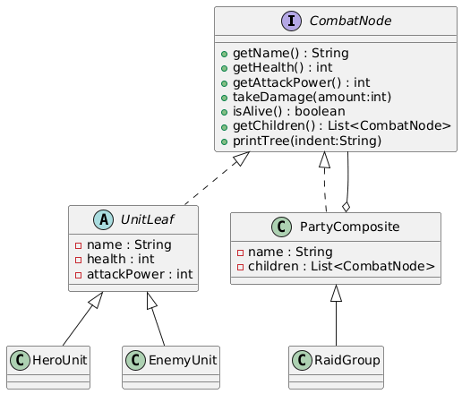
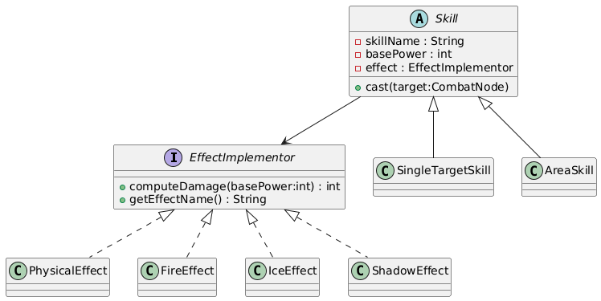

# Homework 4: RPG Raid System - Bridge + Composite

## Overview
You now have heroes, enemies, and a basic battle engine from previous homework. In this assignment, you will design a raid system that supports:
- Flexible skill-effect combinations without class explosion
- Uniform handling of single fighters and nested teams

Your job is to implement:
- **Bridge Pattern** for skill + effect decoupling
- **Composite Pattern** for unit + group hierarchies

## What You Will Build
- A `CombatNode` hierarchy where leaf units and groups share one interface
- A `Skill` hierarchy that delegates damage behavior to `EffectImplementor`
- A raid engine that can run battles for single units and nested groups

## Patterns and Roles
- **Bridge**: `Skill` (abstraction) + `EffectImplementor` (implementor)
- **Composite**: `CombatNode` (component), `UnitLeaf` (leaf), `PartyComposite`/`RaidGroup` (composite)

## Connection to Previous Homework
- HW1: object creation patterns for characters and equipment
- HW2: advanced enemy creation and cloning
- HW3: singleton battle orchestration and API adapters
- HW4: structural flexibility for abilities and team hierarchies

## Requirements at a Glance
- Implement Bridge with at least 2 skill types and 3 effect implementors
- Implement Composite with leaf and nested group behavior
- Integrate both patterns in `RaidEngine`
- Demonstrate all features in `Main.java`
- Provide UML diagrams for Bridge and Composite

## Running the Project
```bash
javac -d out $(find src -name "*.java")
java -cp out com.narxoz.rpg.Main
```

## Deliverables
- Completed Java code
- UML diagrams (2)
- Clear console output from demo

### Composite 


### Bridge


## Ссылка на код
https://github.com/zarina-kulm/homework-rpg-4

Read `ASSIGNMENT.md` for full instructions and rubric.
